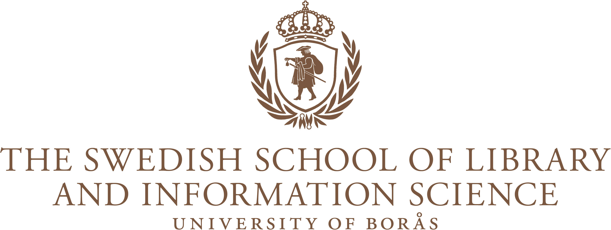
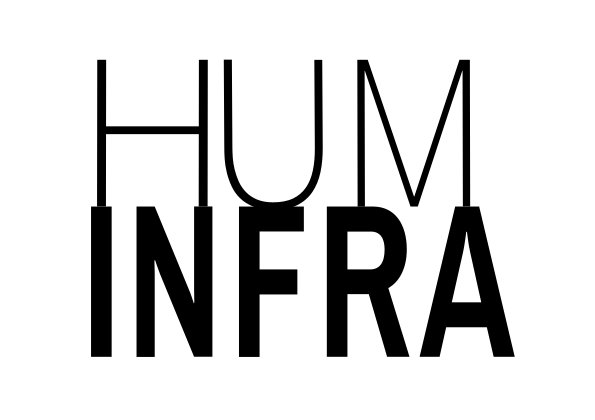
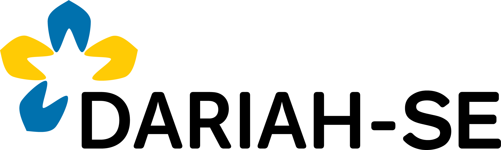

# CCAW

## About

CCAW (pronounced: *see-saw*, like the playground feature) is a training resource that contains a series of tips, warnings, and best practices when it comes to academic writing. They were specifically developed to help students in the [University of Borås](https://www.hb.se/en/)'s [MAIDI](https://www.hb.se/en/international-student/program/programmes/masters-programme-in-information-science-digital-environments/) programme (the Master's Programme in Information Science: Digital Environments) write critical essays and other academic writing assignments. To a large extent, these resources bring together lessons learned from years of assessing students' writing assignments in various programmes across the University of Borås. The materials were developed by [Wout Dillen](https://www.hb.se/forskning/forskningsportal/forskare/wout-dillen/), Senior Lecturer in Library and Information Science at the University of Borås.

## Website Link

🚀 Visit CCAW here: [https://sslis.github.io/ccaw/](https://sslis.github.io/ccaw/).

## Affiliations

This resource was developed during Wout's employment at the University of Borås and is affiliated to [Huminfra](https://www.huminfra.se), the Swedish national infrastructure supporting digital and experimental research in the Humanities. In that capacity, it is developed as an in-kind contribution to [DARIAH-SE](https://www.huminfra.se/dariah), the Swedish national node of [DARIAH-EU](https://www.dariah.eu) (Digital Research Infrastructure for the Arts and Humanities), a Pan-European infrastructure that supports digital research and collaboration in the arts and humanities.

## Technical aspects

This resource is designed as a [Jekyll](https://jekyllrb.com) site that uses the [Just the Docs](https://just-the-docs.com) theme and is built and published on [GitHub Pages](https://docs.github.com/en/pages).

